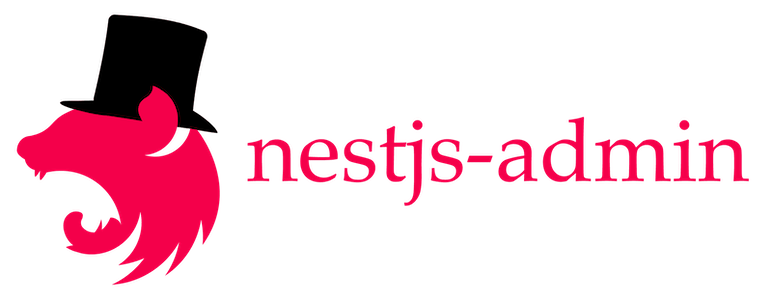

<h3 align="center">
  A generic administration interface for TypeORM entities
</h3>
<p align="center">
  <a href="https://www.npmjs.com/package/nestjs-admin">
    
  </a>
</p>

<div>
  <div align="center">
    <em>Proudly sponsored by <a href="https://www.theodo.co.uk/experts/node-js-fullstack-javascript">Theodo</a></em>
  </div>
  <div align="center">
    <a href="https://www.theodo.co.uk/experts/node-js-fullstack-javascript">
      
    </a>
  </div>
</div>

<br />

---

## Description

Ready-to-use user interface for administrative activities. Allows to list, edit, create, delete entities.

This is heavily, heavily inspired by [Django admin](https://djangobook.com/mdj2-django-admin/), from the concept to the API.

> This is still very much a work in progress. Your help is more than welcome!
> The API is still very unstable. Until a 1.x.x release, **expect breaking changes in minor versions**

**Full docs: https://nestjs-admin.com/**

|              |   |
:-------------------------:|:-------------------------:
  |  
_All your entities in one place._  |  _Create, update and delete entities with ease._


## Installation

Let's get you started with a minimal setup.

1. **Add nestjs-admin to your dependencies:**

```bash
yarn add nestjs-admin # With yarn
npm install nestjs-admin # With NPM
```

2. **Then add the provided `DefaultAdminModule` to your app modules:**

```ts
// src/app.module.ts
import { Module } from '@nestjs/common'
import { DefaultAdminModule } from 'nestjs-admin'

@Module({
  imports: [TypeOrmModule.forRoot(), /* ... */, DefaultAdminModule],
  /* ... */,
})
export class AppModule {
  /* ... */
}
```

3. **Add the provided `AdminUser` to your orm config:**

The DefaultAdminModule exposes an AdminUser entity, which has credentials that allow you to login to the admin interface.

> There's no easy option to use your own user entity for now. If you have this requirement, open an issue so that we can help you.

```ts
// If you use an ormconfig.js
const AdminUser = require('nestjs-admin').AdminUserEntity
module.exports = {
  /* ... */,
  entities: [/* ... */, AdminUser],
  // Alternatively:
  // entities: [/* ... */, 'node_modules/nestjs-admin/**/*.entity.js'],
}
```

```bash
# If you use environment variables
TYPEORM_ENTITIES=your_existing_paths,node_modules/nestjs-admin/**/*.entity.js
```

4. **Create a first AdminUser to log in with**

```bash
# Create the AdminUser schema in database
npx ts-node node_modules/.bin/typeorm migration:generate -n "create-admin-user"
npx ts-node node_modules/.bin/typeorm migration:run

# Now you can create an AdminUser through the CLI
npx nestjs-admin createAdminUser
```

> You can create AdminUsers from the `nestjs-admin createAdminUser` CLI, or directly from the administration interface!

You can now login to access the admin interface at `/admin/login`!

5. **Register entities in the admin site**

```ts
// user.module.ts
import { TypeOrmModule } from '@nestjs/typeorm'
import { Module } from '@nestjs/common'
import { DefaultAdminModule, DefaultAdminSite } from 'nestjs-admin'
import { User } from './user.entity'

@Module({
  imports: [TypeOrmModule.forFeature([User]), DefaultAdminModule],
  exports: [TypeOrmModule],
})
export class UserModule {
  constructor(private readonly adminSite: DefaultAdminSite) {
    // Register the User entity under the "User" section
    adminSite.register('User', User)
  }
}
```

Check the [rest of the docs](./docs) for more details.

## Compatibility

| Library                  | Version |
| ------------------------ | ------- |
| @nestjs/common           | ^6.0.0  |
| @nestjs/core             | ^6.0.0  |
| @nestjs/platform-express | ^6.0.0  |
| @nestjs/typeorm          | ^6.0.0  |
| typeorm                  | ^0.2.12 |

## Contributing

Any contribution is welcome. If you want to implement a feature, you need to know that we are following [django-admin's API](https://docs.djangoproject.com/en/2.2/ref/contrib/admin/) as closely as possible. Why?

- It's been well-thought-out by smart people
- Python translates well to Typescript
- It allows us to not have to think about what the API should look like and just use Django admin as a list of desirable features

### Start the example app

This repo contains an example of how to use nestjs-admin. Here's how to use it:

```bash
# In a first terminal, run the database
cp .env.example .env
docker-compose up

# In a second terminal, compile the library
yarn install
yarn link
yarn start:dev

# In a third terminal, run the example app
cd exampleApp/
yarn install
yarn link nestjs-admin
yarn migration:run
yarn start:debug
```

You can now create an AdminUser (`yarn nestjs-admin createAdminUser`) to be able to login to `localhost:8000/admin`.

The code for the actual library is in `libs/nestjs-admin`.

### Tooling

If you use VSCode, a `.vscode/` is committed that contains a good configuration to contribute. In particular, it contains a config for a ready-to-use debugger.

### ADRs

You'll find [ADRs](https://github.com/joelparkerhenderson/architecture_decision_record#suggestions-for-writing-good-adrs) in `docs/adr`
