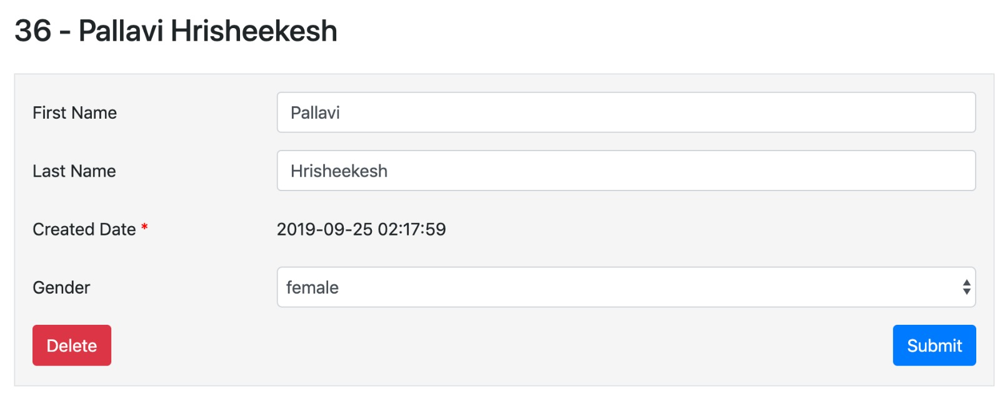
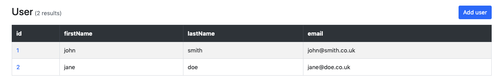
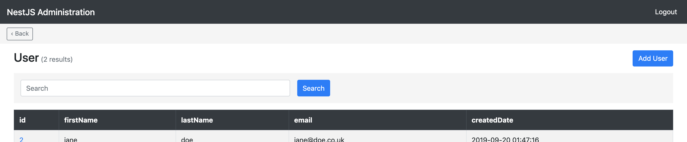

## Registering entities on the admin site

There are two ways you can display an entity on the admin site using `DefaultAdminSite.register`.

In both cases, the first parameter defines the name of the section on the admin site where the entity is registered.

## Registering entities directly

Registering an entity directly will use the default [configuration options](#adminentity-options), and is good enough for most cases.

```typescript
// user.module.ts
import { DefaultAdminSite } from 'nestjs-admin'
import { User } from './user.entity'
import { Group } from './group.entity'

@Module({...})
export class UserModule {
  constructor(private readonly adminSite: DefaultAdminSite) {
    adminSite.register('User', User)
    adminSite.register('User', Group)
    ...
  }
}
```

## Registering entities using the `AdminEntity` class

If you want to add some [configuration options](#adminentity-options), you will need to extend the `AdminEntity` class.

The only required property is `entity` which needs to be [typeorm entity](https://github.com/typeorm/typeorm/blob/master/docs/entities.md) class.

```typescript
// user.admin.ts
import { AdminEntity, DefaultAdminSite } from 'nestjs-admin'
import { User } from './user.entity'
import { Group } from './group.entity'

export class UserAdmin extends AdminEntity {
  entity = User
  // Configuration options go here
}

// user.module.ts
@Module({...})
export class UserModule {
  constructor(private readonly adminSite: DefaultAdminSite) {
    adminSite.register('User', UserAdmin)
    adminSite.register('User', Group)
    ...
  }
}
```

## AdminEntity options

All options are defined on the AdminEntity class:

```typescript
// user.admin.ts
import { AdminEntity } from 'nestjs-admin'
import { User } from './user.entity'

export class UserAdmin extends AdminEntity {
  entity = User
  listDisplay = ['firstname', 'lastname']
}
```

### AdminEntity.fields

Configures which fields of the entity will be displayed (and therefore editable) in the create and update forms.

```typescript
fields = ['firstName', 'lastName', 'createdDate', 'gender']
```



- If you don't set `fields`, the create and update forms will display all properties of the entity

### AdminEntity.listDisplay

Configures which fields of the entity will be displayed on the list page.

```typescript
listDisplay = ['id', 'firstname', 'lastname', 'email']
```



- If you don't set `listDisplay`, the list page will display a single column containing the primary key of the entity, or the `toString()` representation of the entity if defined.

- `listDisplay` values cannot refer to `ManyToOne`, `OneToMany` or `ManyToMany` fields.

### AdminEntity.searchFields

Configures whether the search box will be displayed on the list page, and which fields of the entity will be searched.

```typescript
searchFields = ['firstName', 'lastName', 'createdDate', 'gender']
```



- If you don't set `searchFields`, the search box will not be displayed on the list page.
- If you search for `john`, the entity instances will be displayed if `john` appears in any of the configured fields.
- If you search for `john smith`, an entity instance will be displayed if `john` appears in any of the configured fields AND if `smith` appears in any of the configured fields.
